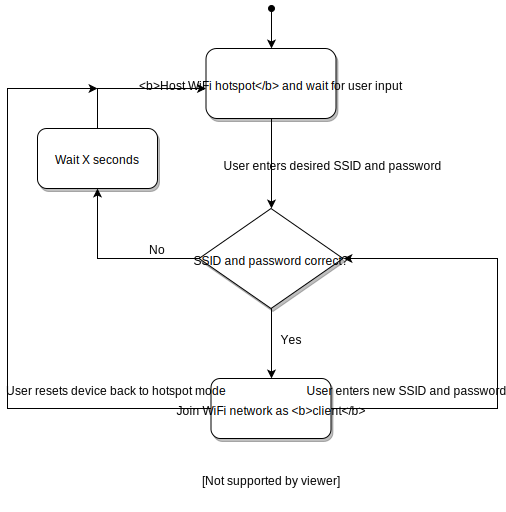

# Raspberry Pi Wifi Onboarding/Dashboard Project

This project aims to create a Python script that does the following:

1. Setup a WiFi hotspot from a fresh Raspbian installation
2. Displays a configuration page that allows the user to enter WiFi network details for the device to connect to as a client
3. Connect to the WiFi network and display a dashboard with live values and a 24 hour graph
4. If the entered network can't be found, revert to hotspot mode

## Flow chart



*The device is displaying the dashboard irrespective of what mode it is in.*

## Installation

In order to install the script from scratch:

1. Flash the Raspberry Pi with [Raspian Stretch](https://www.raspberrypi.org/downloads/raspbian/). I used Raspbian Stretch Lite, which is more minimal and lacks a desktop window manager.
	* For flashing the device I used [Etcher](https://www.balena.io/etcher/).

2. *(Optional)* If you don't have a spare keyboard and monitor, enable ssh by creating a blank file named "ssh" on the Boot drive that appears in Windows Explorer after flashing. This enables ssh, so that you can remotely access the device over the local network.

3. Insert the microSD card, connect the Raspberry Pi via Ethernet to the internet and power it on.

4. On the Raspberry Pi, either over ssh or on the device, run in the console: 
``` bash
sudo apt update
sudo apt install git -y
```

5. Now clone the repo to the device:
``` bash
git clone https://github.com/valmcc/pi-wifi-dash.git
```

6. Run the setup script by entering the following:
``` bash
cd pi-wifi-dash
sudo python3 setup.py
```

The device will display its options and install the necessary packages. On completion a prompt will display asking the user whether they would like to reboot the device to finalise the installation.

## Configuration

*setup.cfg* provides options to modify:

* **SSID** - this determines the network of the hotspot
* **ReconnectionDelay** - this determines how long it takes for the device to return to hotspot mode after either 1) an incorrect SSID is entered or 2) the wifi network the device is connected to goes offline
* **DashboardLogRefresh** - how long to wait between updating values for the dashboard graph

## Devices Tested

* Raspberry Pi 3B
